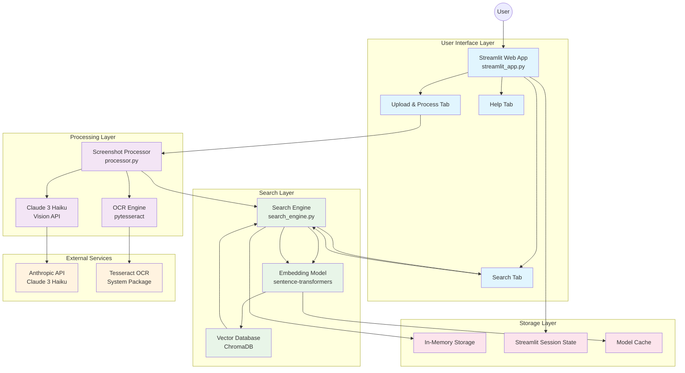
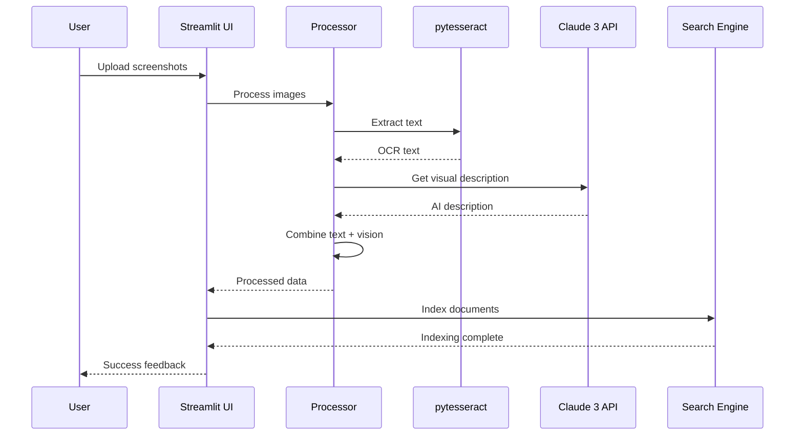
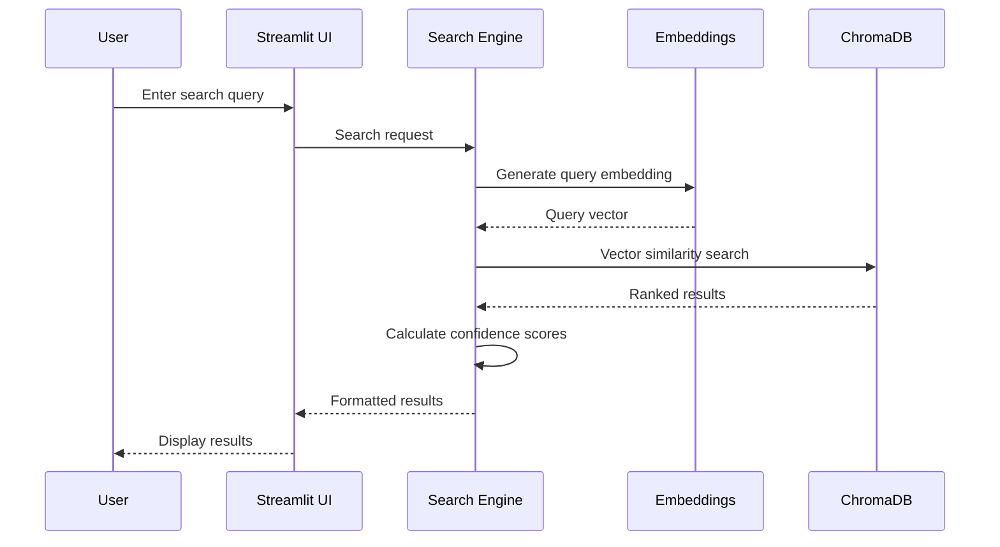
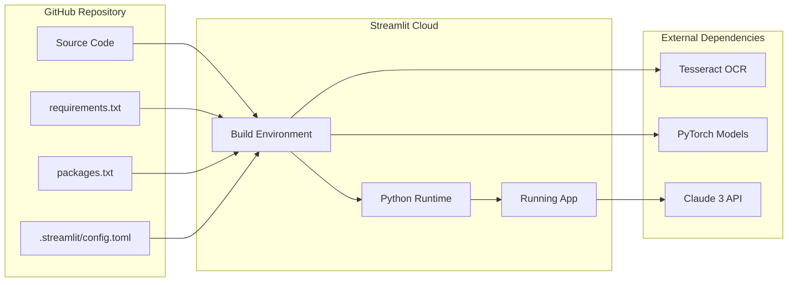

# Visual Memory Search - System Architecture

This document outlines the technical architecture of the Visual Memory Search tool, detailing how components interact to enable semantic screenshot search.

## System Overview

The Visual Memory Search tool is built as a modular system with three core components: image processing, vector search, and web interface. The architecture prioritizes performance, reliability, and deployment simplicity for Streamlit Community Cloud.

## Architecture Diagram

## Component Details

### 1. User Interface Layer (`streamlit_app.py`)

**Purpose**: Web-based interface for screenshot upload, processing, and search

**Key Features**:
- Multi-tab interface (Upload, Search, Help)
- Real-time processing feedback with progress bars
- API key management (environment variables, secrets, UI input)
- Session state management for user data persistence
- Responsive grid layouts for results display

**Design Patterns**:
- Session state for data persistence across interactions
- Lazy initialization of heavy components (processor, search engine)
- Error handling with graceful fallbacks

### 2. Processing Layer (`processor.py`)

**Purpose**: Extracts text and visual information from screenshots

**Key Components**:
- **OCR Engine**: Uses pytesseract for text extraction
- **Vision AI**: Leverages Claude 3 Haiku for visual descriptions
- **Image Optimization**: Resizes and formats images for processing

**Processing Pipeline**:
1. Image validation and optimization
2. OCR text extraction (always runs)
3. AI vision description (if API key available)
4. Text combination and metadata preparation

**Error Handling**:
- Fallback to OCR-only mode if vision API fails
- Automatic image resizing for large files
- Graceful degradation for unsupported formats

### 3. Search Layer (`search_engine.py`)

**Purpose**: Semantic vector search over processed screenshot content

**Key Components**:
- **Embedding Model**: sentence-transformers (all-MiniLM-L6-v2)
- **Vector Database**: ChromaDB with cosine similarity
- **Search Algorithm**: Semantic similarity ranking

**Search Pipeline**:
1. Query embedding generation
2. Vector similarity search in ChromaDB
3. Confidence score calculation (1 - cosine distance)
4. Result ranking and metadata retrieval

**Optimizations**:
- Lazy model loading to avoid initialization issues
- Batch processing for multiple documents
- In-memory storage for fast retrieval

## Data Flow

### Image Processing Flow

### Search Query Flow

## Performance Characteristics

### Latency Metrics
- **Model Loading**: ~15-45 seconds (cold start)
- **Image Processing**: ~3 seconds per image (with API)
- **OCR Only**: ~1 second per image
- **Search Queries**: <1 second
- **Batch Indexing**: ~2-5 seconds per image

### Memory Usage
- **Base Application**: ~50MB
- **Sentence Transformers Model**: ~90MB
- **ChromaDB Index**: ~1MB per 100 images
- **Session State**: ~5MB per 50 processed images

### Scalability Considerations
- **Document Limit**: ~1000 images (Streamlit memory limits)
- **Concurrent Users**: Single-user sessions (Streamlit architecture)
- **API Rate Limits**: Claude 3 Haiku generous limits (~1000 requests/minute)

## Deployment Architecture

### Streamlit Community Cloud Setup

### Environment Configuration
- **Python Version**: 3.9+
- **System Packages**: tesseract-ocr, tesseract-ocr-eng
- **Memory Limit**: 512MB (Streamlit Community Cloud)
- **Storage**: Ephemeral (in-memory only)

## Security Considerations

### API Key Management
- **Environment Variables**: Primary method for production
- **Streamlit Secrets**: Cloud deployment configuration
- **UI Input**: Development/testing only (not persistent)

### Data Privacy
- **No Persistent Storage**: All data cleared on session end
- **In-Memory Processing**: Screenshots not saved to disk
- **API Communication**: HTTPS encrypted to Anthropic

### Error Handling
- **Graceful Degradation**: Falls back to OCR-only mode
- **Input Validation**: File type and size restrictions
- **Rate Limiting**: Built-in API retry logic

## Technology Stack Summary

| Layer | Technology | Purpose |
|-------|------------|---------|
| **Frontend** | Streamlit | Web interface and user interaction |
| **Image Processing** | pytesseract, Pillow | OCR and image manipulation |
| **AI Vision** | Claude 3 Haiku | Visual content understanding |
| **Embeddings** | sentence-transformers | Semantic text representation |
| **Vector Search** | ChromaDB | Similarity search and ranking |
| **Deployment** | Streamlit Cloud | Hosting and CI/CD |
| **Version Control** | Git/GitHub | Source code management |

## Future Architecture Considerations

### Potential Enhancements
1. **Persistent Storage**: Database backend for large-scale deployment
2. **Caching Layer**: Redis for embedding and result caching
3. **Microservices**: Split processing and search into separate services
4. **Batch Processing**: Background job queue for large image sets
5. **Multi-tenancy**: User authentication and data isolation

### Scalability Improvements
1. **Horizontal Scaling**: Multiple worker instances
2. **Model Optimization**: Quantized embeddings for memory efficiency
3. **CDN Integration**: Fast image delivery and caching
4. **API Gateway**: Rate limiting and request routing

This architecture provides a solid foundation for the Visual Memory Search tool while maintaining simplicity for the buildathon demonstration and easy deployment on Streamlit Community Cloud.